# LEKHIKA SYSTEM FLOW DIAGRAMS
**Complete System Flow Visualizations**

---

## 📋 TABLE OF CONTENTS

1. [Workflow Execution Flow](#workflow-execution-flow)
2. [Book Generation Pipeline](#book-generation-pipeline)
3. [AI Provider Integration Flow](#ai-provider-integration-flow)
4. [User Authentication Flow](#user-authentication-flow)
5. [Data Persistence Flow](#data-persistence-flow)
6. [Export Format Flow](#export-format-flow)

---

## 🔄 WORKFLOW EXECUTION FLOW

### Complete Execution Flow:

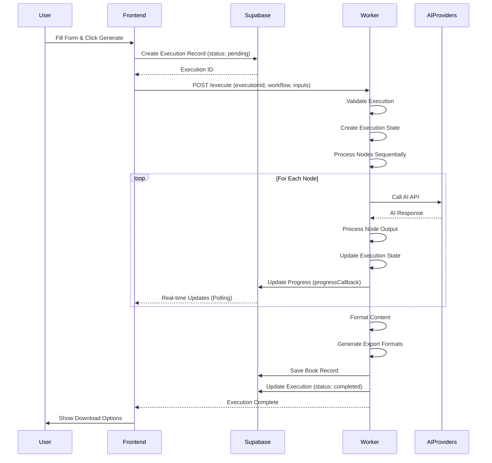

### Detailed Node Processing:

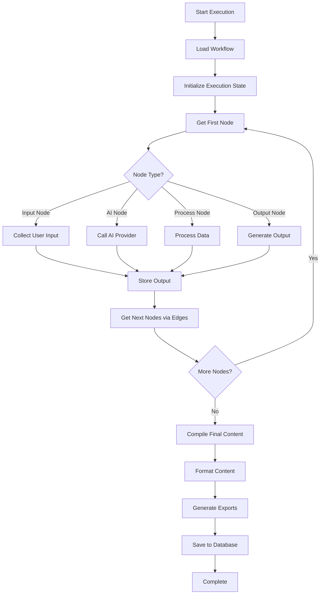

---

## 📚 BOOK GENERATION PIPELINE

### Complete Book Generation Flow:

```mermaid
graph LR
    A[User Input] --> B[Story Requirements Node]
    B --> C[Story Architect Node]
    C --> D[Story Outliner Node]
    D --> E[Chapter Generator Nodes]
    E --> F[Content Compilation]
    F --> G[Professional Formatting]
    G --> H[Format Export]
    H --> I[Storage]
    I --> J[Database Record]
    J --> K[User Download]
```

### Node-by-Node Breakdown:

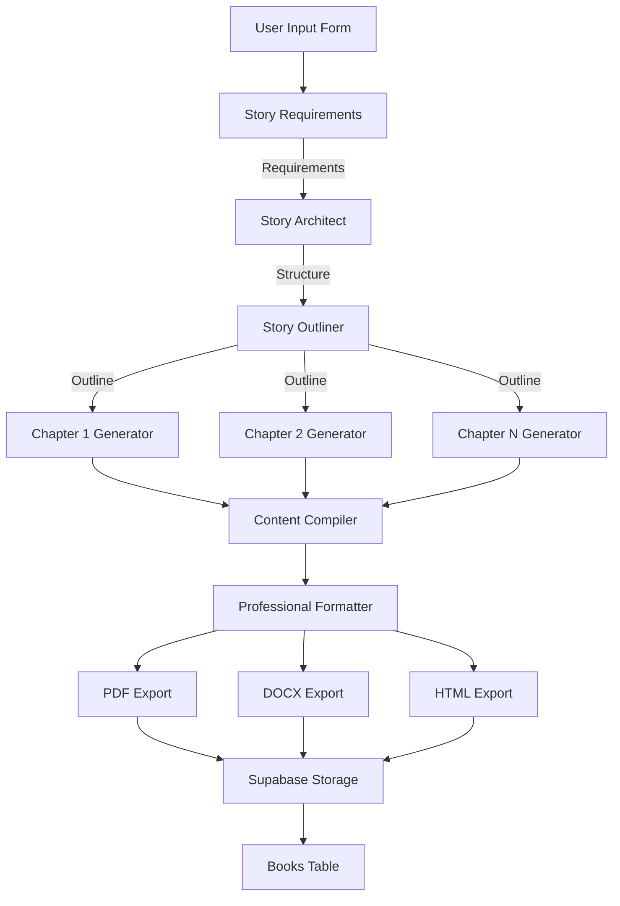

### Format Generation Flow:

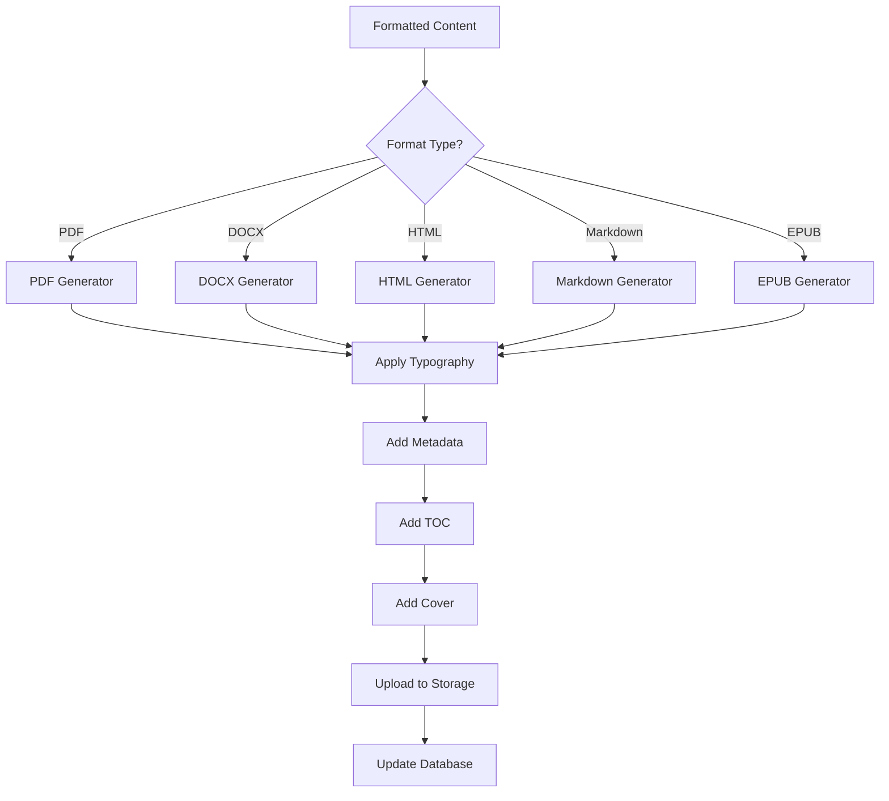

---

## 🤖 AI PROVIDER INTEGRATION FLOW

### AI Service Call Flow:

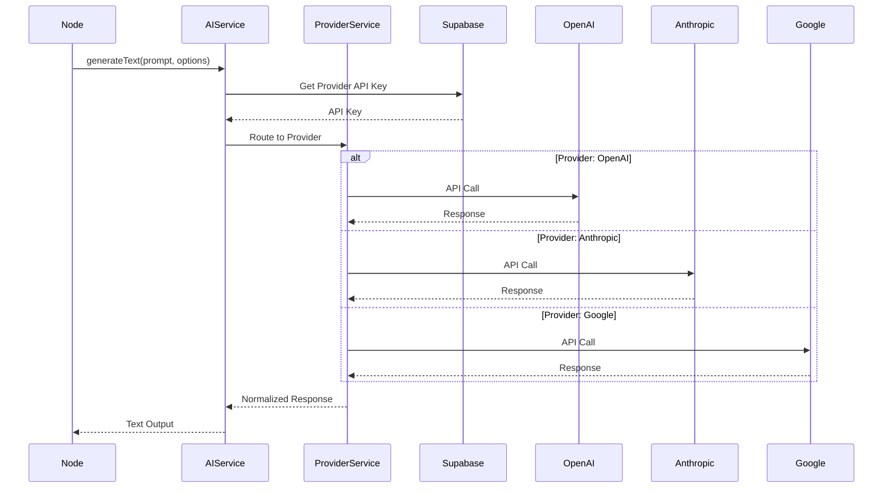

### Multi-AI Orchestration:

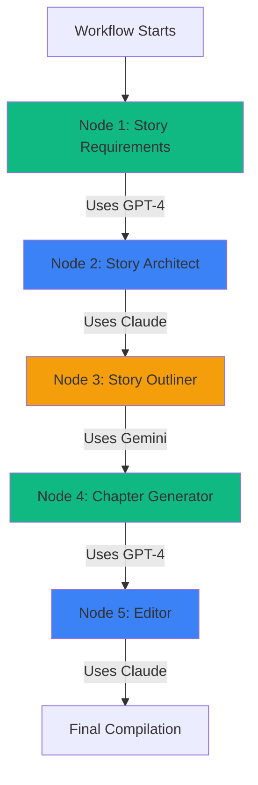

### Provider Selection Logic:

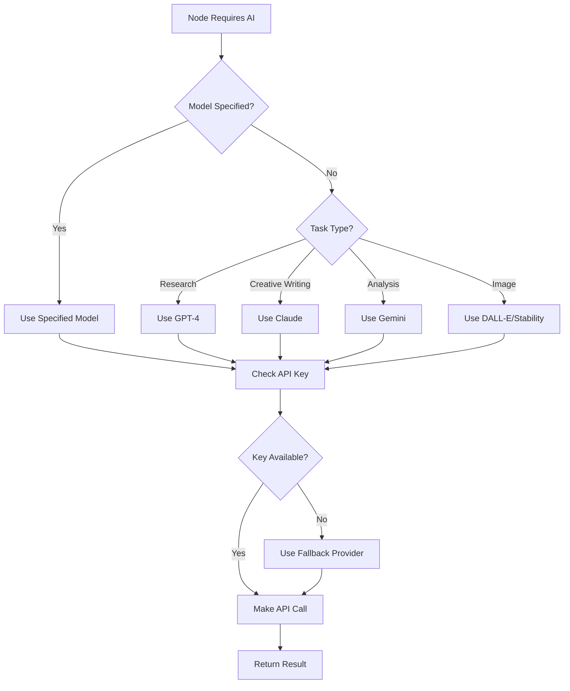

---

## 🔐 USER AUTHENTICATION FLOW

### Login Flow:

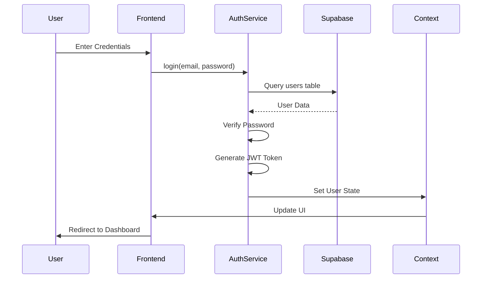

### Registration Flow:

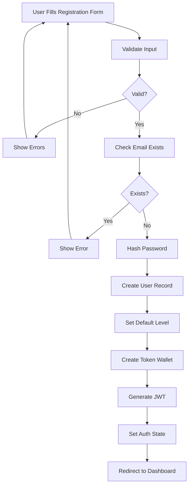

### Protected Route Flow:

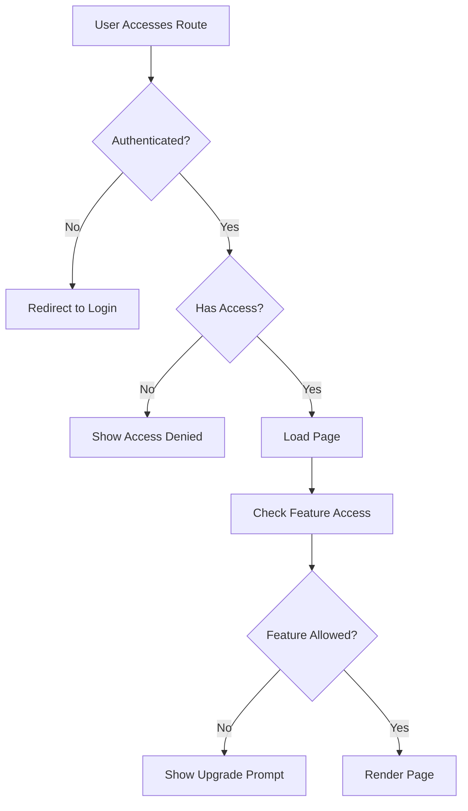

---

## 💾 DATA PERSISTENCE FLOW

### Book Creation Flow:

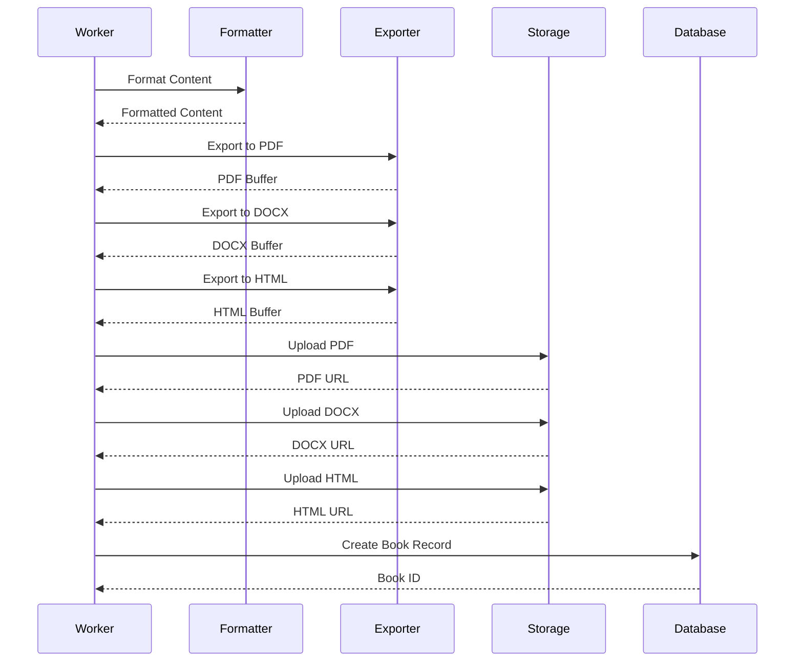

### Execution State Persistence:

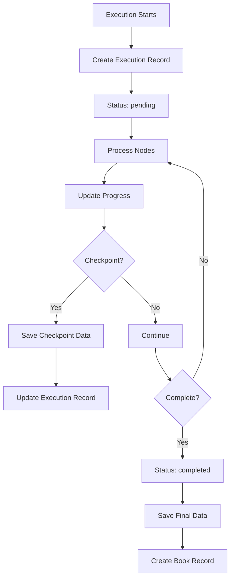

---

## 📤 EXPORT FORMAT FLOW

### Format Export Pipeline:

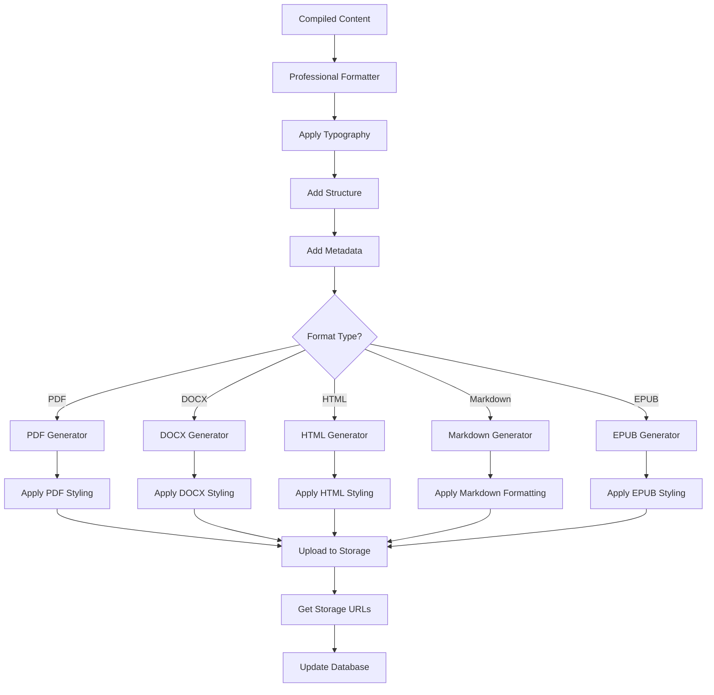

### Format-Specific Processing:

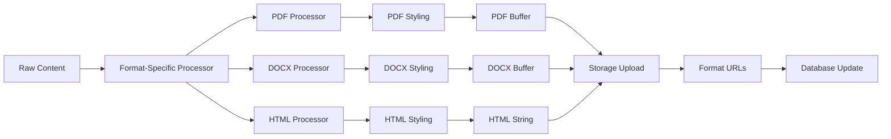

---

## 🔗 RELATED DOCUMENTS

- [LEKHIKA_TECHNICAL_ARCHITECTURE.md](./LEKHIKA_TECHNICAL_ARCHITECTURE.md) - Architecture details
- [LEKHIKA_DEVELOPMENT_GUIDE.md](./LEKHIKA_DEVELOPMENT_GUIDE.md) - Development guide
- [LEKHIKA_FILE_STRUCTURE_DIAGRAM.md](./LEKHIKA_FILE_STRUCTURE_DIAGRAM.md) - File structure

---

**Document Version**: 1.0  
**Last Updated**: 2025-01-XX  
**Maintained By**: Lekhika Documentation Team

