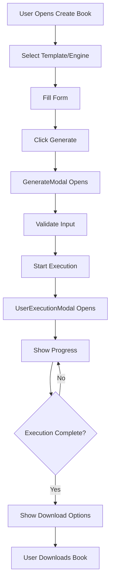
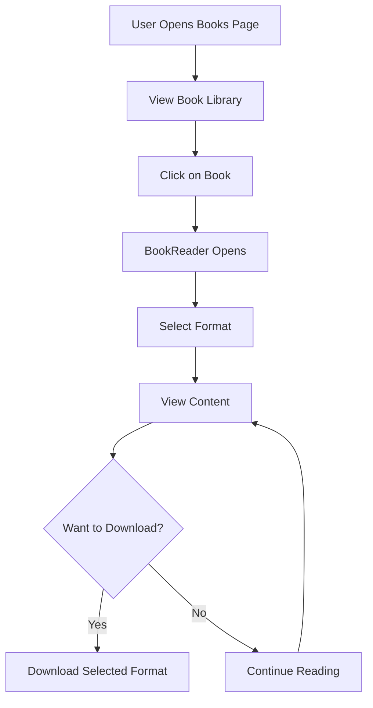
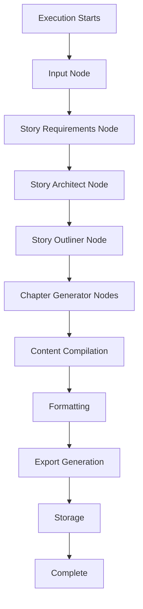

# LEKHIKA UI/UX ARCHITECTURE
**Complete Visual UI/UX Architecture**

---

## 📋 TABLE OF CONTENTS

1. [User Journey Maps](#user-journey-maps)
2. [Page Structure](#page-structure)
3. [Component Hierarchy](#component-hierarchy)
4. [User Flows](#user-flows)
5. [Interaction Patterns](#interaction-patterns)
6. [Design System](#design-system)

---

## 🗺️ USER JOURNEY MAPS

### Journey 1: New User - First Book Creation

```
Landing Page
    ↓
[Sign Up / Login]
    ↓
Dashboard (Onboarding)
    ↓
Create Book Page
    ↓
Template Selection
    ↓
Form Input (Book Details)
    ↓
Generate Modal (Execution)
    ↓
Execution Modal (Progress)
    ↓
AI Thinking Modal (Live Updates)
    ↓
Book Completion
    ↓
Book Reader (Preview)
    ↓
Download / Export
    ↓
Books Page (Library)
```

### Journey 2: Returning User - Quick Book Creation

```
Login
    ↓
Dashboard
    ↓
Create Book (Go-To Engine)
    ↓
Quick Form Fill
    ↓
Generate
    ↓
Monitor Progress
    ↓
Download Result
```

### Journey 3: SuperAdmin - Workflow Creation

```
SuperAdmin Login
    ↓
SuperAdmin Dashboard
    ↓
Engine Management
    ↓
Workflow Builder
    ↓
Node Configuration
    ↓
Form Builder
    ↓
Test Execution
    ↓
Deploy Engine
```

---

## 📄 PAGE STRUCTURE

### Page Hierarchy:

```
App (Root)
│
├── Public Routes
│   ├── Landing Page (/)
│   ├── Sales Page (/sales)
│   ├── Live Page (/live)
│   └── Login/Register (/login, /auth)
│
├── SuperAdmin Routes
│   ├── SuperAdmin Login (/superadmin)
│   ├── SuperAdmin Dashboard (/superadmin/dashboard)
│   └── Levels Management (/superadmin/levels)
│
└── Protected Routes (/app/*)
    ├── Dashboard (/app/dashboard)
    ├── Create Book (/app/create)
    ├── Books Library (/app/books)
    ├── Book Reader (/app/books/:id)
    ├── Content Studio (/app/studio)
    ├── Copy AI Tools (/app/copyai)
    ├── Profile (/app/profile)
    ├── Settings (/app/settings)
    ├── Analytics (/app/analytics)
    └── Billing (/app/billing)
```

### Layout Structure:

```
Layout Component
│
├── Header
│   ├── Logo
│   ├── Navigation
│   ├── User Menu
│   └── Theme Toggle
│
├── Sidebar (Conditional)
│   ├── Navigation Links
│   ├── Quick Actions
│   └── User Stats
│
├── Main Content Area
│   └── [Page Content]
│
└── Footer
    └── Powered By Footer
```

---

## 🧩 COMPONENT HIERARCHY

### Main Component Tree:

```
App
│
├── Layout
│   ├── Header
│   │   ├── Logo
│   │   ├── Navigation
│   │   ├── UserMenu
│   │   └── ThemeToggle
│   │
│   ├── Sidebar (Conditional)
│   │   ├── NavLinks
│   │   ├── QuickActions
│   │   └── UserStats
│   │
│   └── MainContent
│       └── [Routes]
│
├── Pages
│   ├── Dashboard
│   │   ├── StatCards
│   │   ├── RecentBooks
│   │   ├── QuickActions
│   │   └── TokenWallet
│   │
│   ├── CreateBook
│   │   ├── TemplateSelector
│   │   ├── EngineSelector
│   │   ├── FormGenerator
│   │   └── GenerateModal
│   │
│   ├── Books
│   │   ├── BookGrid
│   │   ├── BookCard
│   │   ├── Filters
│   │   └── SearchBar
│   │
│   └── BookReader
│       ├── BookContent
│       ├── FormatSelector
│       └── DownloadButton
│
└── Modals
    ├── GenerateModal
    ├── AIThinkingModal
    ├── UserExecutionModal
    ├── BookReaderModal
    └── SettingsModal
```

### Key Components:

#### 1. GenerateModal
**Purpose**: Collect user input and start generation

**Structure**:
```
GenerateModal
├── FormGenerator (Dynamic Form)
│   ├── FormFields (Based on engine config)
│   └── Validation
├── TokenPrediction
├── SubmitButton
└── CancelButton
```

#### 2. UserExecutionModal
**Purpose**: Monitor execution progress

**Structure**:
```
UserExecutionModal
├── ProgressIndicator
│   ├── CurrentStep
│   ├── ProgressBar
│   └── StepList
├── AIThinkingButton
├── ReRunButton
├── CancelButton
└── DownloadButton (When Complete)
```

#### 3. AIThinkingModal
**Purpose**: Show live AI generation process

**Structure**:
```
AIThinkingModal
├── PhaseIndicator
├── ChapterList
│   └── ChapterItem (Live Updates)
├── ProgressBar
└── CloseButton
```

#### 4. BookReader
**Purpose**: Display generated book

**Structure**:
```
BookReader
├── BookHeader
│   ├── Title
│   ├── Author
│   └── Metadata
├── FormatSelector
├── BookContent
│   ├── TableOfContents
│   ├── Chapters
│   └── Images (If Any)
└── DownloadOptions
```

---

## 🔄 USER FLOWS

### Flow 1: Book Generation Flow



### Flow 2: Book Reading Flow



### Flow 3: Workflow Execution Flow



---

## 🎨 INTERACTION PATTERNS

### Pattern 1: Form Input
**Components**: FormGenerator, UltraInput, UltraFormField

**Flow**:
1. User sees form fields (dynamically generated from engine config)
2. User fills fields
3. Real-time validation
4. Token prediction updates
5. Submit button enabled when valid

**Visual Feedback**:
- Field validation (green/red borders)
- Token prediction display
- Loading states
- Error messages

### Pattern 2: Progress Tracking
**Components**: UserExecutionModal, ProgressIndicator, AIThinkingModal

**Flow**:
1. Execution starts
2. Progress bar updates
3. Current step highlighted
4. Live chapter updates in AI Thinking modal
5. Completion notification

**Visual Feedback**:
- Progress bar animation
- Step indicators
- Live chapter list
- Success/error states

### Pattern 3: Book Display
**Components**: BookReader, BookCard, BookGrid

**Flow**:
1. Book list/grid view
2. Click to open reader
3. Format selector
4. Content display
5. Download options

**Visual Feedback**:
- Hover effects on cards
- Loading states
- Format selection highlight
- Download progress

### Pattern 4: Navigation
**Components**: Header, Sidebar, Navigation Links

**Flow**:
1. User clicks navigation item
2. Route changes
3. Page loads
4. Active state updates

**Visual Feedback**:
- Active link highlighting
- Smooth transitions
- Loading indicators
- Breadcrumbs (if applicable)

---

## 🎨 DESIGN SYSTEM

### Color System:

#### Primary Colors:
- **Primary**: Brand primary color
- **Secondary**: Brand secondary color
- **Accent**: Accent color for highlights

#### Semantic Colors:
- **Success**: Green (success states)
- **Error**: Red (error states)
- **Warning**: Yellow/Orange (warnings)
- **Info**: Blue (information)

#### Theme Support:
- **Light Theme**: Light backgrounds, dark text
- **Dark Theme**: Dark backgrounds, light text
- **Auto**: System preference

### Typography:

#### Font Families:
- **Headings**: Professional serif/sans-serif
- **Body**: Readable sans-serif
- **Code**: Monospace

#### Font Sizes:
- **H1**: Large headings
- **H2**: Section headings
- **H3**: Subsection headings
- **Body**: Default text
- **Small**: Secondary text

### Spacing:

#### Spacing Scale:
- **xs**: 4px
- **sm**: 8px
- **md**: 16px
- **lg**: 24px
- **xl**: 32px
- **2xl**: 48px

### Components:

#### Ultra Components:
- **UltraButton**: Primary button component
- **UltraCard**: Card container
- **UltraInput**: Input field
- **UltraLoader**: Loading spinner
- **UltraProgress**: Progress indicator

#### Design Principles:
- **Consistency**: Consistent patterns across app
- **Clarity**: Clear visual hierarchy
- **Feedback**: Immediate visual feedback
- **Accessibility**: WCAG compliant
- **Responsive**: Mobile-first design

### Animations:

#### Animation Library:
- **Framer Motion**: Primary animation library
- **Transitions**: Smooth page transitions
- **Micro-interactions**: Button hovers, clicks
- **Loading States**: Skeleton screens, spinners

#### Animation Principles:
- **Purposeful**: Animations serve a purpose
- **Smooth**: 60fps animations
- **Fast**: Quick, not sluggish
- **Subtle**: Enhance, don't distract

---

## 🔗 RELATED DOCUMENTS

- [LEKHIKA_FILE_STRUCTURE_DIAGRAM.md](./LEKHIKA_FILE_STRUCTURE_DIAGRAM.md) - File structure
- [LEKHIKA_TECHNICAL_ARCHITECTURE.md](./LEKHIKA_TECHNICAL_ARCHITECTURE.md) - Technical details
- [LEKHIKA_FEATURES_AND_CAPABILITIES.md](./LEKHIKA_FEATURES_AND_CAPABILITIES.md) - Features

---

**Document Version**: 1.0  
**Last Updated**: 2025-01-XX  
**Maintained By**: Lekhika Documentation Team


